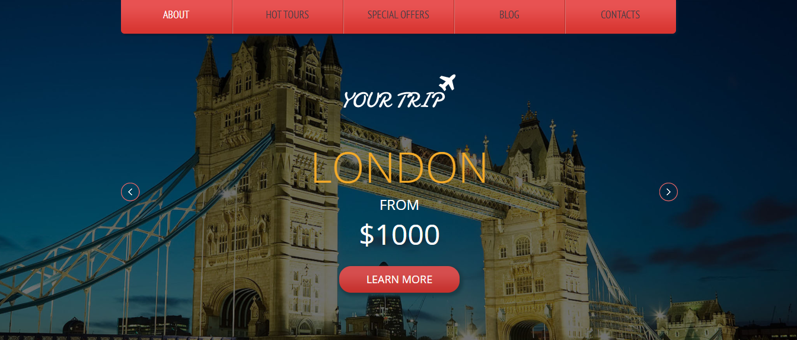

## Introduction
Promo traveling is a dedicated web application for travel agencies to facilitate the management of travel services for clients.

## Informations
-   Status: under development
- Lastest version: 1.0
- Sector Tourism
- Created: November 2020
- Last updated: November 2020

## Table of contents
* [Documentation](#general-info)
* [Demo](#demo)
* [Screenshots](#screenshots)
* [Technologies](#technologies)
* [Setup](#setup)
* [Features](#features)
* [Status](#status)
* [Contact](#contact)
* [License](#license)

## Documentation
https://github.com/aniskchaou/PROMO-TRAVELING-FRONTOFFICE-USER/wiki

## Demo
https://promo-traveling.herokuapp.com/

## Screenshots

## Technologies
* PHP
* Symfony

## Setup

## Features
 -  Manage customer reservations

## Contact
contact@delta-dev-software.com

## License
<a href="license.txt">MIT License</a>
